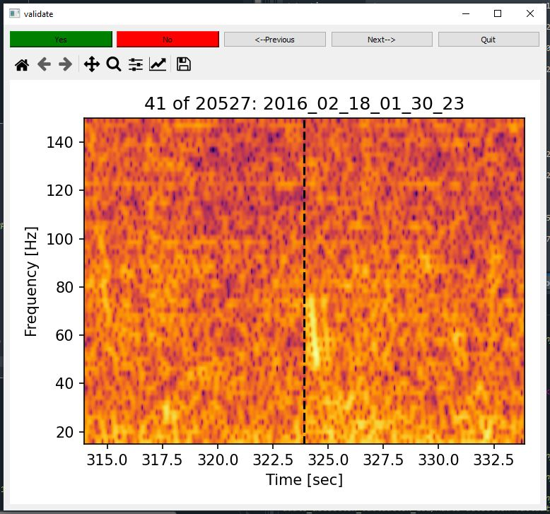
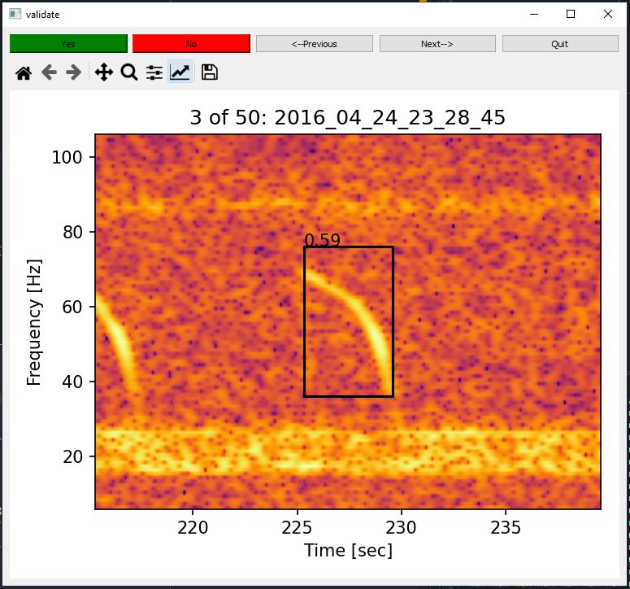

# Audio detection validation GUI

A python script that generates a GUI to check if detected audio signals are true (yes) or false (no) positives. -  

- Logs the result for each click as csv file

- labeling can be pickup up later even when program is closed

## For simple time stamps

Use the "validation_gui.py" script



## For shapematching bounding-boxes

Use the "validation_gui_shapematching.py" script



Here is how it works:

First load the necesarry modules and the shapematching results Dataframe (.csv files for each audiofile). And choose which label and threshold you want to use to define detections. Here I am using 'dcall_score' and a threshold of 0.3. 

```python
import soundfile as sf
from scipy import signal
import numpy as np
from matplotlib import pyplot as plt
import pandas as pd
import datetime as dt
import time
import os
import glob
import librosa

#%% user input

os.chdir(r'D:\passive_acoustics\detector_delevopment\final_detections')

# if yoy have load the dtection dataframe already:
sm=pd.read_hdf(r"D:\passive_acoustics\detector_delevopment\final_detections\shapematching2016.h5")

# if you have the raw shapematcing .csvs only
folder=r'D:\passive_acoustics\detector_delevopment\final_detections\shapematching2016\*.csv'
sm=pd.DataFrame()
csv_names=glob.glob(folder)
for path in csv_names:
    smnew=pd.read_csv(path)   
    ix_score=np.char.endswith( list(smnew.columns.values),'score')
    ix=np.where(np.sum( smnew.iloc[:,ix_score]>0 ,axis=1))[0]
    sm=pd.concat([sm,smnew.loc[ix,:]],ignore_index=True)
sm['realtime']=pd.to_datetime(sm['realtime'])
# sm.to_hdf('shapematching2016.h5', key='df', mode='w')

# sort out the detecions you want
ix=np.where( sm['dcall_score']>0.3 )[0]
detections=  sm.loc[ix,:]
detections=detections.reset_index(drop=True)
detections['realtime']=pd.to_datetime(detections['realtime'])
detections['score']=detections['dcall_score']

# the space left and right of the detection in the plor (in seconds)
offset_sec=10 
offset_f=30 

# the frequency limits of the spectrogram
# f_lim=[15,150]

# the spectrogram resolution
fft_size=2**15

# if yo have already labeled parts of the detections, specify the path to your old csv file here
# old_csv='detection_validations.csv'
```
Than this loop calculates all the spectrgram images 

```python
#%% load spectrogram images

detections_spectrog={}
detections_extent={}

audiopath_old='3254dsanaswqe'
for ix in range(len(detections)):
 
     audiopath=detections.loc[ix,'filename']

     if not audiopath==audiopath_old:     
         x, fs = sf.read(audiopath,dtype='int16')    
         f, t, Sxx = signal.spectrogram(x, fs, window='hamming',nperseg=fft_size,noverlap=fft_size*0.9)
         print(audiopath)
                   
     t1=detections.loc[ix,'t-1'] - offset_sec
     if t1<0:
         t1=0
     t2=detections.loc[ix,'t-2'] + offset_sec
     if t2>t[-1]:
         t12=t[-1]
     f1=detections.loc[ix,'f-1'] - offset_f
     f2=detections.loc[ix,'f-2'] + offset_f
     
     ix_t=np.where( (t>=t1) & (t<=t2) )[0]
     ix_f=np.where((f>=f1) & (f<=f2))[0]
     spectrog =10*np.log10( Sxx[ ix_f[0]:ix_f[-1],ix_t[0]:ix_t[-1] ] )
     
     detections_spectrog[ix]=spectrog
     detections_extent[ix]=[t1,t2,f1,f2]    
     audiopath_old=audiopath

```

The comes the clicking gui that logs resulst into a csv file named 'detection_validations.csv'


```python
#%% set labels and load labels from previous session

labels=np.ones(len(detections))*np.nan

if ('old_csv' in locals()):
    a=pd.read_csv(old_csv, index_col=0)
    labels=a.iloc[:,1].values
        
#%% clicking gui

from PyQt5 import QtCore, QtGui, QtWidgets
import sys
# from PyQt5.QtWidgets import QShortcut
# from PyQt5.QtGui import QKeySequence

from matplotlib.backends.backend_qt5agg import FigureCanvasQTAgg, NavigationToolbar2QT as NavigationToolbar
from matplotlib.figure import Figure


class MplCanvas(FigureCanvasQTAgg ):

    def __init__(self, parent=None, width=5, height=4, dpi=100):
        self.fig = Figure(figsize=(width, height), dpi=dpi)
        self.axes = self.fig.add_subplot(111)
        super(MplCanvas, self).__init__(self.fig)

class MainWindow(QtWidgets.QMainWindow):

    def __init__(self, *args, **kwargs):
        super(MainWindow, self).__init__(*args, **kwargs)

        self.canvas =  MplCanvas(self, width=5, height=4, dpi=150)   
       ##############
        self.audiopath_old='jkbfaa'
        
        # self.detections_af=detections_af
        self.detections=detections
        self.labels=labels
        self.ixnan=np.where(pd.Series(self.labels).isna())[0]
        self.ii=0
        self.ix=self.ixnan[self.ii]
        
        def plot_detection():
  
            detection_time=self.detections.loc[self.ix,'realtime']
         
     
            self.canvas.fig.clf() 
            self.canvas.axes = self.canvas.fig.add_subplot(111)
            
            spectrog = detections_spectrog[self.ix]
            
            self.canvas.axes.imshow(spectrog ,cmap='inferno',aspect='auto',origin = 'lower',extent = detections_extent[self.ix] )
            self.canvas.axes.set_ylabel('Frequency [Hz]')
            self.canvas.axes.set_xlabel('Time [sec]')
              
            # td=np.argmin(np.abs(self.rectime-detection_time))
            
            xx=[ self.detections.loc[self.ix,'t-1'],self.detections.loc[self.ix,'t-2'],self.detections.loc[self.ix,'t-2'],self.detections.loc[self.ix,'t-1'],self.detections.loc[self.ix,'t-1'] ]
            yy=[ self.detections.loc[self.ix,'f-1'],self.detections.loc[self.ix,'f-1'],self.detections.loc[self.ix,'f-2'],self.detections.loc[self.ix,'f-2'],self.detections.loc[self.ix,'f-1']]
            
            self.canvas.axes.plot(xx,yy , '-k')
            self.canvas.axes.text(self.detections.loc[self.ix,'t-1'],self.detections.loc[self.ix,'f-2'],str(self.detections.loc[self.ix,'score'].round(2)) ,color= 'k')
            
            # self.canvas.axes.arrow(self.t[td], 100, 0,-20, length_includes_head=True,
            #       width=1)
            
            targetname=detection_time.strftime('%Y_%m_%d_%H_%M_%S')
            self.canvas.axes.set_title(str(self.ix)+' of ' + str(len(self.detections)) +': ' + targetname)
            self.canvas.fig.tight_layout()
            self.canvas.draw()            
        

 ######## layout
        outer_layout = QtWidgets.QVBoxLayout()
        
        top_layout = QtWidgets.QHBoxLayout()       
        
        button_yes=QtWidgets.QPushButton('Yes')
        def yes_func():                
            plot_detection()
            self.labels[self.ix]=1
            self.ii=self.ii+1  
            if self.ii>=len(self.labels):
                self.ii=len(self.labels)-1
                print('THE END')
            self.ix=self.ixnan[self.ii]
        # export data
            annot=pd.concat([self.detections['realtime'],pd.Series(self.labels)],axis=1,ignore_index=True)
            annot.to_csv('detection_validations.csv')
            
        button_yes.clicked.connect(yes_func)     
        button_yes.setStyleSheet("background-color: green")
        top_layout.addWidget(button_yes)

    
        button_no=QtWidgets.QPushButton('No')
        def no_func():                
            plot_detection()
            self.labels[self.ix]=0
            self.ii=self.ii+1  
            if self.ii>=len(self.labels):
                self.ii=len(self.labels)-1
                print('THE END')
            self.ix=self.ixnan[self.ii]
# export data
            annot=pd.concat([self.detections,pd.Series(self.labels)],axis=1,ignore_index=True)
            annot.to_csv('detection_validations.csv')    
        button_no.clicked.connect(no_func)    
        button_no.setStyleSheet("background-color: red")
        top_layout.addWidget(button_no)
        
        button_previous=QtWidgets.QPushButton('<--Previous')
        def previous_func():    
            self.ii=self.ii-1  
            if self.ii<0:
                self.ii=0
            self.ix=self.ixnan[self.ii]
            plot_detection()
            # self.labels[self.ix]=0
            print(self.labels)
            self.ix=self.ix+1           
        button_previous.clicked.connect(previous_func)    
        top_layout.addWidget(button_previous)
        
        button_next=QtWidgets.QPushButton('Next-->')
        def next_func():    
            self.ii=self.ii+1  
            if self.ii>=len(self.labels):
                self.ii=len(self.labels)-1
                print('THE END')
            self.ix=self.ixnan[self.ii]
            if self.ix<0:
                self.ix=0
            plot_detection()
            # self.labels[self.ix]=0
            print(self.labels)
            self.ix=self.ix+1           
        button_next.clicked.connect(next_func)    
        top_layout.addWidget(button_next)
        
        
        # top_layout.addWidget(button_no)
        # top_layout.addWidget(button_previous)
        button_quit=QtWidgets.QPushButton('Quit')
        button_quit.clicked.connect(QtWidgets.QApplication.instance().quit)
        top_layout.addWidget(button_quit)


        # combine layouts together
        
        plot_layout = QtWidgets.QVBoxLayout()
        toolbar = NavigationToolbar( self.canvas, self)
        plot_layout.addWidget(toolbar)
        plot_layout.addWidget(self.canvas)
        
        outer_layout.addLayout(top_layout)
        outer_layout.addLayout(plot_layout)
        
        # self.setLayout(outer_layout)
        
        # Create a placeholder widget to hold our toolbar and canvas.
        widget = QtWidgets.QWidget()
        widget.setLayout(outer_layout)
        self.setCentralWidget(widget)
        
        # #### hotkeys
        self.msgSc1 = QtWidgets.QShortcut(QtCore.Qt.Key_Right, self)
        self.msgSc1.activated.connect(next_func)
        self.msgSc2 = QtWidgets.QShortcut(QtCore.Qt.Key_Left, self)
        self.msgSc2.activated.connect(previous_func)        
 
      
        plot_detection()
        self.show()


app = QtWidgets.QApplication(sys.argv)
app.setApplicationName("validate")

w = MainWindow()
sys.exit(app.exec_())

```
